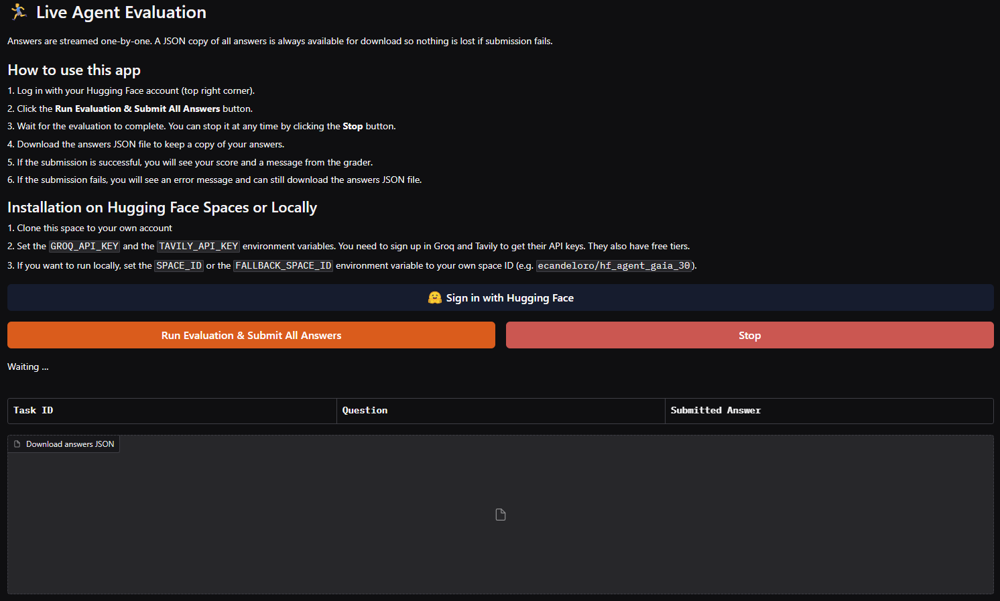

## 🚀 HF Agent GAIA 🕵🏻‍♂️

[](https://www.python.org/)
[](https://langchain-ai.github.io/langgraph/)
[](https://huggingface.co/spaces/ecandeloro/hf_agent_gaia_30)
[](https://github.com/astral-sh/ruff)
[](https://github.com/astral-sh/uv)

This repository contains an AI agent developed for the [Hugging Face Agents Course](https://huggingface.co/agents-course). The primary goal of this project is to create a robust agent capable of tackling tasks from the [GAIA Benchmark](https://huggingface.co/gaia-benchmark).

The agent is built using Python and leverages the power of [LangGraph](https://langchain-ai.github.io/langgraph/) for creating a stateful, multi-actor agent. It interacts with various tools to gather information, perform actions, and ultimately solve complex problems.

### 📸 Demo
<p align="center">
  
</p>

### 🛠️ Setup with `uv`

This project uses `uv` for Python package management. `uv` is a fast Python package installer and resolver, written in Rust.

To set up the environment:
1.  Install `uv`: Follow the instructions at [https://github.com/astral-sh/uv](https://github.com/astral-sh/uv).
2.  Create a virtual environment and install dependencies:
    ```bash
    uv venv
    uv pip install -r requirements.txt
    ```
    Or, if you prefer to use the `pyproject.toml`:
    ```bash
    uv sync
    ```

### 🔑 API Keys

To use this agent, you will need API keys for the following services:

*   **Groq**: For fast LLM inference. You can get a key from [GroqCloud](https://console.groq.com/keys).
*   **Tavily AI**: For the comprehensive web search tool. You can get a key from [Tavily AI](https://tavily.com/).

Once you have your keys, create a `.env` file in the root of the project and add your keys like this:

```env
GROQ_API_KEY="gsk_YOUR_GROQ_API_KEY"
TAVILY_API_KEY="tvly-YOUR_TAVILY_API_KEY"
```

Replace `gsk_YOUR_GROQ_API_KEY` and `tvly-YOUR_TAVILY_API_KEY` with your actual API keys. The agent will load these keys automatically.

### 🤖 Agent Architecture

The core of the agent is built with LangGraph. It follows a ReAct (Reason + Act) prompting strategy.

1.  **LLM**: The agent uses a Large Language Model (LLM) hosted on Groq (e.g., `qwen/qwen3-32b` or `llama3-8b-8192`) for its reasoning capabilities.
2.  **Prompting**: A base prompt (`base_prompt.txt`) guides the LLM's behavior, instructing it on how to use the available tools and respond to user queries.
3.  **Tools**: The agent has access to a suite of tools to interact with the external world. These tools allow it to:
    *   Perform mathematical calculations (e.g., `calculator`, `multiply`, ...).
    *   Search the web and specific platforms (e.g., `web_search` via Tavily, `wiki_search`, `arxiv_search`).
    *   Read and write files (e.g., `read_file`, `write_file`, `list_files`).
    *   Download files from URLs (`download_file`).
    *   Fetch and parse web page content (`get_url`, `get_url_text`).
    *   Process images (captioning with `image_captioner`, OCR with `ocr`).
4.  **Graph**: The LangGraph framework orchestrates the flow of information between the LLM and the tools. The `agent.py` file defines the graph structure, including:
    *   An `AgentState` to hold the current state of the conversation and any input files.
    *   An `assistant` node that calls the LLM.
    *   A `ToolNode` that executes the chosen tool.
    *   Conditional edges that determine the next step based on the LLM's output (e.g., call a tool or respond to the user).

The `create_react_agent` function from `langgraph.prebuilt` is used to quickly set up a ReAct agent with the specified LLM and tools.

### 📁 Repository Structure

*   `.github/workflows/sync-to-hf.yml`: GitHub Actions workflow to automatically sync the repository to a Hugging Face Space.
*   `agent.py`: Defines the LangGraph agent, its state, and the interaction logic.
*   `app.py`: Gradio application to interact with the agent.
*   `base_prompt.txt`: The system prompt for the LLM.
*   `pyproject.toml`: Project metadata and dependencies for `uv`.
*   `requirements.txt`: List of Python dependencies (can be generated from `pyproject.toml`).
*   `tools.py`: Defines all the tools available to the agent.